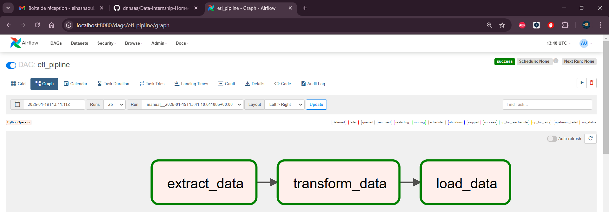
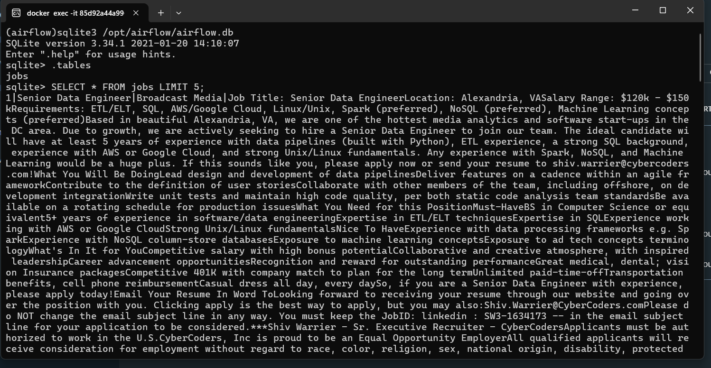
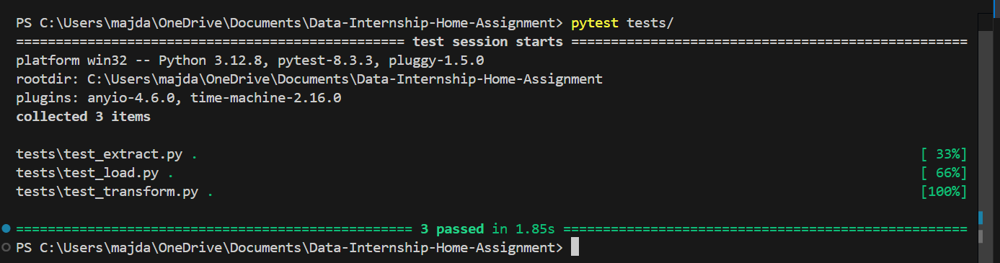

# ETL Pipeline with Airflow

This project demonstrates an ETL (Extract, Transform, Load) pipeline using Apache Airflow. It processes job posting data, performs transformations, and loads the cleaned data into a SQLite database. The pipeline is deployed in a Docker environment for easy execution and scalability.

## Project Structure

```plaintext
Data-Internship-Home-Assignment/
├── dags/
│   ├── etl_dag.py      # Main DAG script that orchestrates the ETL process
│   └── tasks/
│       ├── extract.py  # Logic for extracting data
│       ├── transform.py # Logic for transforming data
│       └── load.py     # Logic for loading data into SQLite
│ ── source/
│   └── jobs.csv        # The source CSV file containing the job data to be processed
├── staging/
│   ├── extracted/      # Extracted files (TXT format)
│   └── transformed/    # Transformed files (JSON format)
├── tests/
│   ├── test_extract.py # Unit tests for the extraction task
│   ├── test_transform.py # Unit tests for the transformation task
│   └── test_load.py    # Unit tests for the loading task
└── requirements.txt    # Project dependencies
└── docker-compose.yml  # Docker Compose configuration for running Airflow
```

### Docker Compose

To run this ETL pipeline with Docker, use the provided `docker-compose.yml` file. This file contains all the necessary services for running Airflow (webserver, scheduler, and database). 

1. **Start the services**: You can start the services in detached mode with the following command:
   ```bash
   docker-compose up -d
   ```
   This will launch Airflow Webserver on `http://localhost:8080`.

2. **Volumes**: The volumes in `docker-compose.yml` map local directories to the Airflow container, ensuring your local files and logs are synced. Here are the volume mappings:
   - `./dags:/opt/airflow/dags`: Local `dags` directory to store your DAG scripts.
   - `./logs:/opt/airflow/logs`: Local `logs` directory for Airflow's logs.
   - `./plugins:/opt/airflow/plugins`: Local `plugins` directory for custom Airflow plugins.
   - `./source:/opt/airflow/source`: Local `source` directory to store the raw CSV data.
   - `./staging:/opt/airflow/staging`: Local `staging` directory to store extracted and transformed files.
   - `./tests:/opt/airflow/tests`: Local `tests` directory to store your unit tests.

### DAG and Tasks

The main DAG is located in `dags/etl_dag.py`. This DAG defines three tasks:

1. **Extract Task** (`dags/tasks/extract.py`):
   - Reads the `jobs.csv` file located in `/source/jobs.csv`.
   - Extracts the job description data from the `context` column.
   - Saves each extracted entry as a `.txt` file in the `staging/extracted/` directory.

2. **Transform Task** (`dags/tasks/transform.py`):
   - Reads the `.txt` files from the `staging/extracted/` directory.
   - Cleans and structures the data into the desired format (JSON).
   - Saves the transformed data as `.json` files in the `staging/transformed/` directory.
   - The desired schema for the transformed data includes job details, company information, education requirements, experience, salary details, and location information.

3. **Load Task** (`dags/tasks/load.py`):
   - Reads the transformed JSON files from `staging/transformed/`.
   - Loads the cleaned data into a SQLite database using SQLAlchemy.
   - The SQLite database is created in the container and used to store job posts with related data (job, company, education, experience, salary, and location).

### Data Flow

- **Raw Data**: The raw job posting data is stored in the `jobs.csv` file under the `/source` directory.
- **Extracted Data**: The extracted job descriptions are saved as `.txt` files in the `staging/extracted/` directory.
- **Transformed Data**: The cleaned and structured data is stored as `.json` files in the `staging/transformed/` directory, following the defined schema.
- **Final Storage**: The final data is loaded into a SQLite database for easy querying.



### Example of Transformed Data Schema

```json
{
  "job": {
    "title": "Software Engineer",
    "industry": "Technology",
    "description": "Develop software solutions...",
    "employment_type": "Full-time",
    "date_posted": "2024-01-19"
  },
  "company": {
    "name": "Tech Corp",
    "link": "https://linkedin.com/company/tech-corp"
  },
  "education": {
    "required_credential": "Bachelor's degree in Computer Science"
  },
  "experience": {
    "months_of_experience": 24,
    "seniority_level": "Junior"
  },
  "salary": {
    "currency": "USD",
    "min_value": 60000,
    "max_value": 80000,
    "unit": "per year"
  },
  "location": {
    "country": "USA",
    "locality": "New York",
    "region": "NY",
    "postal_code": "10001",
    "street_address": "123 Main St",
    "latitude": 40.7128,
    "longitude": -74.0060
  }
}
```


### Unit Testing

Unit tests are written using `pytest` to ensure the ETL tasks work as expected.

- **Test Extraction**: `tests/test_extract.py` contains unit tests for the `extract_jobs` function to verify that data is correctly extracted from the CSV file.
- **Test Transformation**: `tests/test_transform.py` contains unit tests for the `transform_jobs` function to validate that the transformation process produces the correct data in JSON format.
- **Test Loading**: `tests/test_load.py` contains unit tests for the `load_to_sqlite` function to ensure that the transformed data is correctly loaded into the SQLite database.

#### Screenshot of Tests



---


### Conclusion

This project demonstrates how to set up and execute a complete ETL pipeline using Apache Airflow in a Dockerized environment. The pipeline extracts, transforms, and loads job data into a SQLite database, and is fully testable with unit tests.

